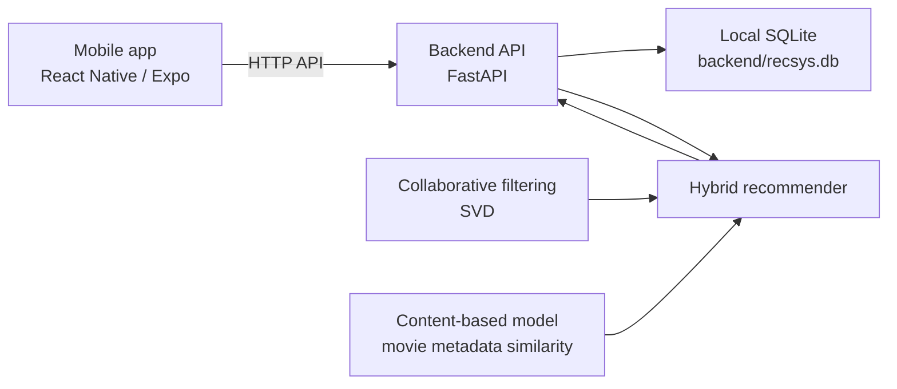

# Movie Recommendation Mobile App

[Turkce README](README.tr.md)

A prototype movie recommendation system built with a React Native / Expo mobile app and a Python FastAPI backend. The recommender combines collaborative filtering, content-based similarity, and a weighted hybrid score to produce personalized top-N movie suggestions.

The repository is prepared for source release. Local SQLite data is intentionally excluded: `backend/recsys.db` is generated or provisioned locally and must not be committed.

## Architecture



## Repository Layout

- `backend/` - FastAPI app, SQLite helpers, SVD recommender, content model, hybrid scoring, and backend dependencies.
- `mobile/` - Expo app with login/register, cold-start survey, home recommendations, swipe feedback, and admin analytics screens.
- `docs/` - Turkish project explanation documents.
- `.env.example` - Example local runtime settings.
- `.github/workflows/ci.yml` - Basic GitHub Actions workflow after CI setup.

## Recommendation Approach

The backend trains and combines three signals:

- Collaborative filtering: `backend/cf_svd.py` builds an SVD-based user-item signal from ratings.
- Content-based filtering: `backend/content_v2.py` builds movie metadata vectors and user profiles.
- Hybrid scoring: `backend/hibrit.py` blends collaborative, content, and popularity scores. Cold-start users receive different weights so the survey answers have more influence.

Reported prototype evaluation:

| Approach | Recall@20 |
| --- | ---: |
| Hybrid | 63.29% |
| Content-based | 20.00% |
| Collaborative filtering | 15.47% |

## Prerequisites

- Python 3.11 or newer
- Node.js 20 or newer
- npm
- Expo-compatible Android/iOS device, emulator, or web target

## Backend Setup

```powershell
cd backend
python -m venv .venv
.\.venv\Scripts\Activate.ps1
python -m pip install --upgrade pip
python -m pip install -r requirements.txt
```

Create the local SQLite schema when starting from an empty checkout:

```powershell
python -c "from db_schema import initialize_database; initialize_database()"
```

Before running the API, populate `backend/recsys.db` with compatible `movies`, `ratings`, and `users` data. The API trains recommender models during startup, so an empty database is useful for schema creation only and is not enough for real recommendations.

Run the API:

```powershell
uvicorn api:app --reload --host 0.0.0.0 --port 8000
```

Useful endpoints:

- `GET /survey-movies?n=10`
- `GET /check-user?user_id=1`
- `GET /recommend-user?user_id=1&n_recs=10`
- `POST /recommend-from-ratings?n_recs=10`
- `GET /admin/analytics`
- `GET /admin/inspect-user?user_id=1`
- `POST /register`
- `POST /login`

## Mobile Setup

```powershell
cd mobile
npm install
npm start
```

Set the backend address in `mobile/src/config.js` before testing on a real device. Android emulators can use `http://10.0.2.2:8000`; physical devices need the computer's LAN IP address.

## Quick Run

1. Prepare a local, populated `backend/recsys.db`. Keep it untracked.
2. Start the backend from `backend/` with `uvicorn api:app --reload --host 0.0.0.0 --port 8000`.
3. Start the mobile app from `mobile/` with `npm start`.
4. Open the app, register or log in, complete the cold-start survey, and view the daily recommendation cards on the home screen.

## Packaging Notes

- `*.db`, `recsys.db`, and `backend/recsys.db` are ignored to keep local data out of source control.
- `mobile/package-lock.json` is tracked for reproducible npm installs.
- `.env.example` is tracked as documentation only; the current backend code uses `backend/db_helper.py` for the SQLite path.
- The project is a prototype and does not include production data seeding, hosted infrastructure, or secret management.

## License

MIT. See [LICENSE](LICENSE).
