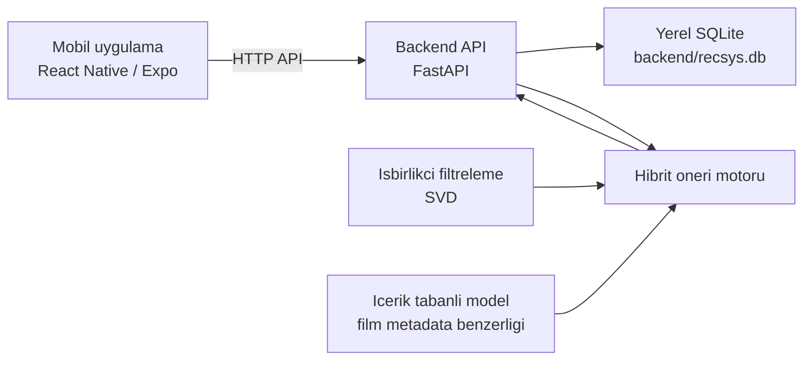

# Makine Ogrenmesi Tabanli Kisisellestirilmis Film Oneri Sistemi

[Read in English](README.md)

Bu proje, React Native / Expo mobil uygulamasi ve Python FastAPI backend'i kullanan prototip bir hibrit film oneri sistemidir. Sistem, kullanici puanlari ile film icerik ozelliklerini birlestirerek kisisellestirilmis top-N film onerileri uretir.

Kaynak kod yayinina hazirlik icin yerel SQLite verisi repoya dahil edilmez. `backend/recsys.db` yerelde olusturulur veya saglanir ve git'e eklenmemelidir.

## Mimari



## Dosya Yapisi

- `backend/` - FastAPI uygulamasi, SQLite yardimcilari, SVD modeli, icerik modeli, hibrit skor hesaplama ve backend bagimliliklari.
- `mobile/` - Expo uygulamasi; giris/kayit, cold-start anketi, ana sayfa onerileri, kaydirma geri bildirimi ve admin analiz ekranlari.
- `docs/` - Proje anlatimi ve teknik dokumantasyon.
- `.env.example` - Ornek yerel calisma ayarlari.
- `.github/workflows/ci.yml` - CI eklendikten sonra temel GitHub Actions akisi.

## Oneri Yaklasimi

Backend uc sinyali egitir ve birlestirir:

- Isbirlikci filtreleme: `backend/cf_svd.py`, puanlardan SVD tabanli kullanici-film sinyali uretir.
- Icerik tabanli filtreleme: `backend/content_v2.py`, film metadata vektorleri ve kullanici profilleri olusturur.
- Hibrit skor: `backend/hibrit.py`, isbirlikci skor, icerik skoru ve populerlik skorunu agirlikli olarak birlestirir. Cold-start kullanicilarda anket cevaplarinin etkisi daha yuksektir.

Prototip degerlendirme sonuclari:

| Yaklasim | Recall@20 |
| --- | ---: |
| Hibrit | 63.29% |
| Icerik tabanli | 20.00% |
| Isbirlikci filtreleme | 15.47% |

## Gereksinimler

- Python 3.11 veya daha yeni
- Node.js 20 veya daha yeni
- npm
- Expo ile uyumlu Android/iOS cihaz, emulator veya web hedefi

## Backend Kurulumu

```powershell
cd backend
python -m venv .venv
.\.venv\Scripts\Activate.ps1
python -m pip install --upgrade pip
python -m pip install -r requirements.txt
```

Bos bir klondan basliyorsaniz yerel SQLite semasini olusturun:

```powershell
python -c "from db_schema import initialize_database; initialize_database()"
```

API'yi calistirmadan once `backend/recsys.db` icinde uyumlu `movies`, `ratings` ve `users` verilerinin bulunmasi gerekir. API acilista oneri modellerini egitir; bu nedenle bos veritabani sadece sema olusturmak icin yeterlidir, gercek oneri uretmez.

API'yi calistirin:

```powershell
uvicorn api:app --reload --host 0.0.0.0 --port 8000
```

Yararli endpoint'ler:

- `GET /survey-movies?n=10`
- `GET /check-user?user_id=1`
- `GET /recommend-user?user_id=1&n_recs=10`
- `POST /recommend-from-ratings?n_recs=10`
- `GET /admin/analytics`
- `GET /admin/inspect-user?user_id=1`
- `POST /register`
- `POST /login`

## Mobil Kurulum

```powershell
cd mobile
npm install
npm start
```

Gercek cihazla test etmeden once backend adresini `mobile/src/config.js` icinde ayarlayin. Android emulator `http://10.0.2.2:8000` adresini kullanabilir; fiziksel cihazlar bilgisayarin yerel ag IP adresine ihtiyac duyar.

## Hizli Calistirma

1. Yerel ve doldurulmus bir `backend/recsys.db` hazirlayin. Bu dosyayi git disinda tutun.
2. `backend/` klasorunden `uvicorn api:app --reload --host 0.0.0.0 --port 8000` komutuyla backend'i baslatin.
3. `mobile/` klasorunden `npm start` komutuyla mobil uygulamayi baslatin.
4. Uygulamada kayit olun veya giris yapin, cold-start anketini tamamlayin ve ana sayfadaki gunluk oneri kartlarini goruntuleyin.

## Paketleme Notlari

- `*.db`, `recsys.db` ve `backend/recsys.db` git disinda tutulur.
- `mobile/package-lock.json`, tekrarlanabilir npm kurulumu icin takip edilir.
- `.env.example` dokumantasyon amaciyla takip edilir; mevcut backend kodu SQLite yolu icin `backend/db_helper.py` dosyasini kullanir.
- Proje prototiptir; uretim veri yukleme, hosted altyapi veya secret yonetimi icermez.

## Lisans

MIT. Ayrinti icin [LICENSE](LICENSE) dosyasina bakin.
