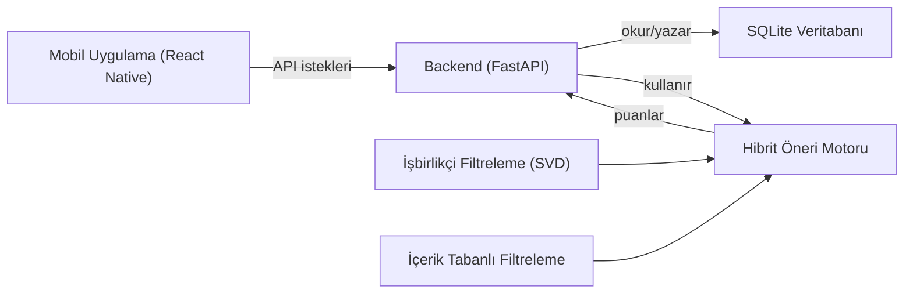

# Makine Öğrenmesi Tabanlı Kişiselleştirilmiş Film Öneri Sistemi

[Read in English](README.md)

TÜBİTAK 2209-A projesi kapsamında React Native mobil uygulama, Python/FastAPI backend ve SQLite veritabanı kullanan hibrit bir film öneri sistemi.


## Problem ve Motivasyon

Bu proje, cold-start ve öneri kalitesi sorununu kullanıcı davranışı ve içerik benzerliğini birleştiren hibrit bir modelle çözmeyi amaçlar. Amacımız, kullanıcı/film benzerliği ve benzer kullanıcı davranışlarını ağırlıklı denklemle birleştirerek akademik bir bağlamda top-10 öneri üretimini göstermek.

## Mimari



## Teknolojiler

- React Native / Expo
- FastAPI
- Python
- SQLite
- Scikit-learn
- Pandas
- SQLAlchemy

## Kurulum ve Çalıştırma

### Backend

```bash
cd backend
python -m venv .venv
.venv\Scripts\Activate.ps1
pip install -r requirements.txt
uvicorn api:app --reload --host 0.0.0.0 --port 8000
```

### Mobil

```bash
cd mobile
npm install
npm start
```

## Örnek Kullanım ve Cold-Start

1. Mobil uygulamayı açın ve 20 filmlik anketi tamamlayın.
2. Uygulama puanları backend’e gönderir.
3. Backend hibrit model kullanarak top-10 öneri listesi üretir.
4. Kullanıcı kişiselleştirilmiş film önerilerini görür.

## Deneysel Sonuçlar

| Yaklaşım | Recall@20 |
|---|---|
| Hibrit | 63.29% |
| İçerik Tabanlı | 20.00% |
| İşbirlikçi Filtreleme | 15.47% |

## Bilinen Sınırlamalar

- SQLite ve yerel dosyalar kullanır; üretim ölçeğine uygun değildir.
- Cold-start, ilk anket verisinin kalitesine bağlıdır.
- Dağıtım ve ölçeklenebilirlik altyapısı içermez.

## Lisans

MIT Lisansı
